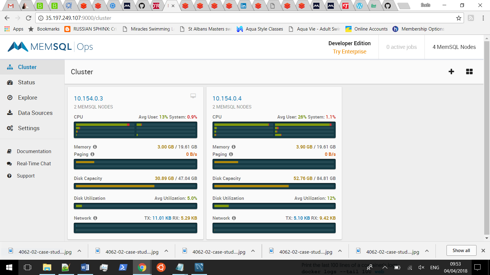
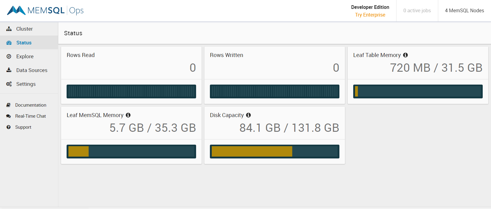
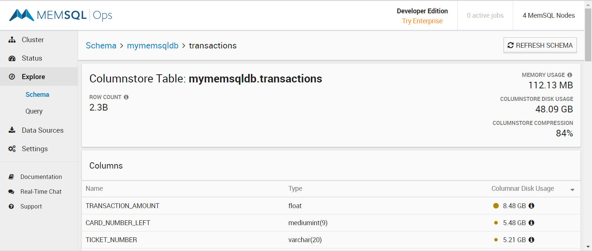
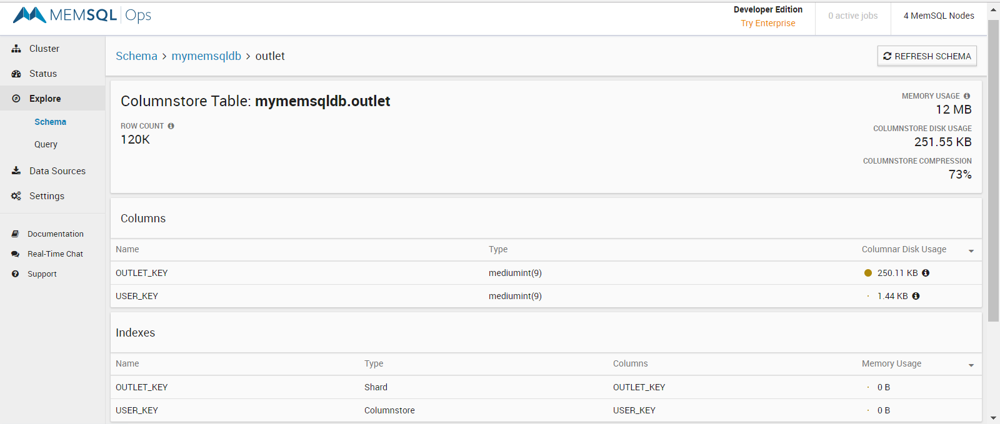

# Memsql performance evaluation

## Infrastructure
2 VMs on GCP. Each VM having 8 vCPUs, 20 GB memory and SSD disks in europe-west2-a zone.

One VM has an aggregator and a leaf node and other VM has two leaf nodes.

## Schema Design
- Create payment transactions table

```
CREATE TABLE `transactions` (
  `OUTLET_KEY` mediumint(9) DEFAULT NULL,
  `TRADING_DATE` date DEFAULT NULL,
  `PROCESSING_DATE` date DEFAULT NULL,
  `TRANSACTION_DATETIME` datetime DEFAULT NULL,
  `TRANSACTION_DATE` date DEFAULT NULL,
  `CARD_NUMBER_LENGTH` tinyint(4) DEFAULT NULL,
  `CARD_NUMBER_LEFT` mediumint(9) DEFAULT NULL,
  `CARD_NUMBER_RIGHT` smallint(6) DEFAULT NULL,
  `CARD_EXPIRY_DATE` varchar(5) CHARACTER SET utf8 COLLATE utf8_general_ci DEFAULT NULL,
  `CARD_ISSUER_NUMBER` varchar(2) CHARACTER SET utf8 COLLATE utf8_general_ci DEFAULT NULL,
  `CARD_START_DATE` varchar(5) CHARACTER SET utf8 COLLATE utf8_general_ci DEFAULT NULL,
  `TRANSACTION_TYPE_KEY` tinyint(4) DEFAULT NULL,
  `TRANSACTION_SOURCE_KEY` tinyint(4) DEFAULT NULL,
  `SETTLEMENT_AMOUNT` float DEFAULT NULL,
  `SETTLEMENT_CURRENCY_KEY` varchar(3) CHARACTER SET utf8 COLLATE utf8_general_ci DEFAULT NULL,
  `TRANSACTION_AMOUNT` float DEFAULT NULL,
  `TRANSACTION_CURRENCY_KEY` varchar(3) CHARACTER SET utf8 COLLATE utf8_general_ci DEFAULT NULL,
  `ACQUIRED_PROCESSED_KEY` smallint(6) DEFAULT NULL,
  `CARD_PRODUCT_KEY` smallint(6) DEFAULT NULL,
  `CARD_PRODUCT_TYPE_KEY` smallint(6) DEFAULT NULL,
  `CARD_SCHEME_KEY` smallint(6) DEFAULT NULL,
  `SEQUENCE_NO` varchar(10) CHARACTER SET utf8 COLLATE utf8_general_ci DEFAULT NULL,
  `AUTH_CODE` varchar(20) CHARACTER SET utf8 COLLATE utf8_general_ci DEFAULT NULL,
  `AUTH_METHOD_KEY` smallint(6) DEFAULT NULL,
  `RECEIPT_NUMBER` varchar(20) CHARACTER SET utf8 COLLATE utf8_general_ci DEFAULT NULL,
  `CASH_AMOUNT` float DEFAULT NULL,
  `ORIGINATORS_TRANSACTION_REF` varchar(100) CHARACTER SET utf8 COLLATE utf8_general_ci DEFAULT NULL,
  `TICKET_NUMBER` varchar(20) CHARACTER SET utf8 COLLATE utf8_general_ci DEFAULT NULL,
  KEY `TRANSACTION_DATETIME` (`TRANSACTION_DATETIME`,`CARD_SCHEME_KEY`,`TRANSACTION_TYPE_KEY`,`TRANSACTION_CURRENCY_KEY`,`PROCESSING_DATE`) /*!90619 USING CLUSTERED COLUMNSTORE */,
  /*!90618 SHARD */ KEY `OUTLET_KEY` (`OUTLET_KEY`)
) /*!90621 AUTOSTATS_ENABLED=TRUE */
```

- Create outlet table which has user-outlet relationship.

```
CREATE TABLE `outlet` (
  `OUTLET_KEY` mediumint(9) DEFAULT NULL,
  `USER_KEY` mediumint(9) DEFAULT NULL,
  KEY `USER_KEY` (`USER_KEY`) /*!90619 USING CLUSTERED COLUMNSTORE */,
  /*!90618 SHARD */ KEY `OUTLET_KEY` (`OUTLET_KEY`)
) /*!90621 AUTOSTATS_ENABLED=TRUE */
```

- Load 1.2B rows into transactions table

- Evenly distribute outlets numbering 120k into 20 users - Large corporates users

```
insert into mymemsqldb.outlet 
select a.outlet_key, mod(a.outlet_key,20) as user_key
from (select distinct outlet_key from mymemsqldb.transactions) a;
```

- Add two users with only a few outlets - SME users

```
insert into mymemsqldb.outlet values (0,20); 
insert into mymemsqldb.outlet values (1,21);
insert into mymemsqldb.outlet values (2,21);
insert into mymemsqldb.outlet values (3,21);
insert into mymemsqldb.outlet values (4,21);
insert into mymemsqldb.outlet values (5,21);
```

## Memsql Ops screens

- Cluster


- Status


- Transactions table


- Outlet table

