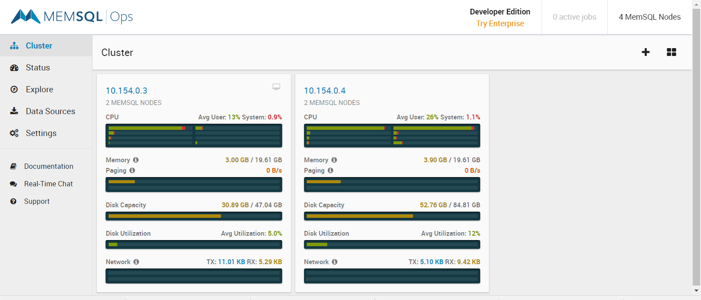
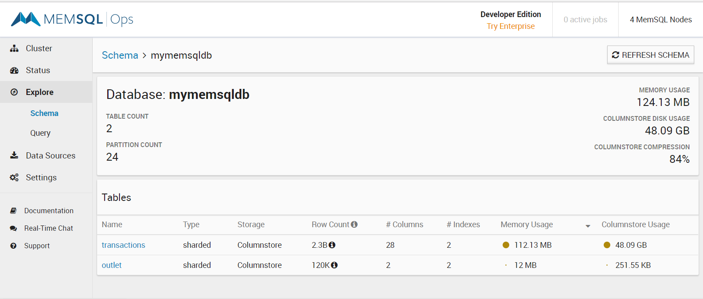
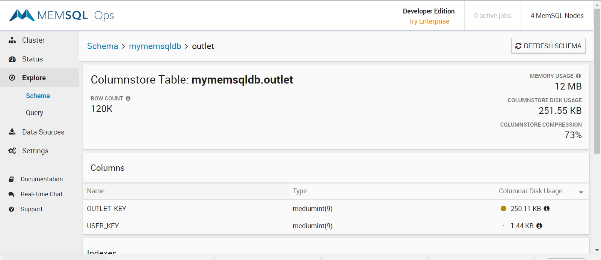

# MemSQL performance evaluation

## Infrastructure
2 VMs provisioned on Google Cloud Platform in europe-west2-a zone. 

- VM#1 
  - Machine type - custom (8 vCPUs, 20 GB memory)
  - CPU platform - Intel Broadwell
  - 50GB SSD persistent disk 
  - source image - debian-9-stretch-v20180307
  - MemSQL - Master aggregator and a leaf node

- VM#2 
  - Machine type - custom (8 vCPUs, 20 GB memory)
  - CPU platform - Intel Broadwell
  - 90GB SSD persistent disk 
  - source image - debian-9-stretch-v20180307
  - MemSQL - Two leaf nodes

## Install MemSQL on both VMs
Download the software
```
cd /tmp
wget http://download.memsql.com/memsql-ops-6.0.10/memsql-ops-6.0.10.tar.gz
tar zxvf memsql-ops-6.0.10.tar.gz
```
Run the installer
```
cd memsql-ops-6.0.10
sudo ./install.sh
```

Make the second VM follow the first one. At this point MemSQL Ops Web UI should be able to see both VMs as part of cluster.
```
memsql-ops follow -h <master-vm-ip>
```

From the MemSQL Ops Web UI, add MemSQL nodes with one master and three leaf node roles across the two VMs.

For starting/stopping the cluster use the below commands
```
memsql-ops memsql-stop --all
memsql-ops memsql-start --all
```

## Schema Design

- Create database

```
create database mymemsqldb;
show databases;
use mymemsqldb;
```

- Create payment transactions table

```
CREATE TABLE `transactions` (
  `OUTLET_KEY` mediumint(9) DEFAULT NULL,
  `TRADING_DATE` date DEFAULT NULL,
  `PROCESSING_DATE` date DEFAULT NULL,
  `TRANSACTION_DATETIME` datetime DEFAULT NULL,
  `TRANSACTION_DATE` date DEFAULT NULL,
  `CARD_NUMBER_LENGTH` tinyint(4) DEFAULT NULL,
  `CARD_NUMBER_LEFT` mediumint(9) DEFAULT NULL,
  `CARD_NUMBER_RIGHT` smallint(6) DEFAULT NULL,
  `CARD_EXPIRY_DATE` varchar(5) CHARACTER SET utf8 COLLATE utf8_general_ci DEFAULT NULL,
  `CARD_ISSUER_NUMBER` varchar(2) CHARACTER SET utf8 COLLATE utf8_general_ci DEFAULT NULL,
  `CARD_START_DATE` varchar(5) CHARACTER SET utf8 COLLATE utf8_general_ci DEFAULT NULL,
  `TRANSACTION_TYPE_KEY` tinyint(4) DEFAULT NULL,
  `TRANSACTION_SOURCE_KEY` tinyint(4) DEFAULT NULL,
  `SETTLEMENT_AMOUNT` float DEFAULT NULL,
  `SETTLEMENT_CURRENCY_KEY` varchar(3) CHARACTER SET utf8 COLLATE utf8_general_ci DEFAULT NULL,
  `TRANSACTION_AMOUNT` float DEFAULT NULL,
  `TRANSACTION_CURRENCY_KEY` varchar(3) CHARACTER SET utf8 COLLATE utf8_general_ci DEFAULT NULL,
  `ACQUIRED_PROCESSED_KEY` smallint(6) DEFAULT NULL,
  `CARD_PRODUCT_KEY` smallint(6) DEFAULT NULL,
  `CARD_PRODUCT_TYPE_KEY` smallint(6) DEFAULT NULL,
  `CARD_SCHEME_KEY` smallint(6) DEFAULT NULL,
  `SEQUENCE_NO` varchar(10) CHARACTER SET utf8 COLLATE utf8_general_ci DEFAULT NULL,
  `AUTH_CODE` varchar(20) CHARACTER SET utf8 COLLATE utf8_general_ci DEFAULT NULL,
  `AUTH_METHOD_KEY` smallint(6) DEFAULT NULL,
  `RECEIPT_NUMBER` varchar(20) CHARACTER SET utf8 COLLATE utf8_general_ci DEFAULT NULL,
  `CASH_AMOUNT` float DEFAULT NULL,
  `ORIGINATORS_TRANSACTION_REF` varchar(100) CHARACTER SET utf8 COLLATE utf8_general_ci DEFAULT NULL,
  `TICKET_NUMBER` varchar(20) CHARACTER SET utf8 COLLATE utf8_general_ci DEFAULT NULL,
  KEY `TRANSACTION_DATETIME` (`TRANSACTION_DATETIME`,`CARD_SCHEME_KEY`,`TRANSACTION_TYPE_KEY`,`TRANSACTION_CURRENCY_KEY`,`PROCESSING_DATE`) /*!90619 USING CLUSTERED COLUMNSTORE */,
  /*!90618 SHARD */ KEY `OUTLET_KEY` (`OUTLET_KEY`)
) /*!90621 AUTOSTATS_ENABLED=TRUE */
```

- Used Oracle SQL query to generate data and exported to csv 

```
SELECT mod(column_value,15013) as OUTLET_KEY,
trunc(current_date - interval '1' second * column_value) as TRADING_DATE,
trunc(current_date - interval '1' second * column_value + interval '1' day) as PROCESSING_DATE,
(current_date - interval '1' second * column_value) as TRANSACTION_DATETIME,
trunc(current_date - interval '1' second * column_value) as TRANSACTION_DATE,
16 as CARD_NUMBER_LENGTH,
trunc(dbms_random.value() * (999999-100000) + 100000) as CARD_NUMBER_LEFT,
trunc(DBMS_RANDOM.VALUE() * (9999-1000) + 1000) as CARDT_NUMBER_RIGHT,
'12/19' as card_expiry_date,
'01' as card_issuer_number,
'01/17' as card_start_date,
mod(column_value,4) transaction_type_key, 
mod(column_value,16) transaction_source_key,
0 as settlement_amount,
'GBP' as settlement_currency_key,
round(dbms_random.value()*200,2) as transaction_amount,
'GBP' as transaction_currency_key,
mod(column_value,2) as acquired_processed_key,
mod(mod(column_value,29),11) as CARD_PRODUCT_KEY,
mod(column_value,29) as CARD_PRODUCT_TYPE_KEY,
mod(mod(column_value,29),3) as CARD_SCHEME_KEY,	
mod(column_value,11) as sequence_no,
lpad(round(dbms_random.value()*4000),4,1) as auth_code,
mod(column_value,11) as auth_method_key,
round(dbms_random.value()*4000) as receipt_number,
0 as cash_amount,
'W0400000S8157200942'||round(mod(column_value,15013)) as originators_transaction_ref,
round(dbms_random.value()*50000) as ticket_number
FROM table(swe_datatools.generate_series(1,100000000));
```

- Load 2.3B rows into transactions table.

```
memsql> load data infile './export11.csv' into table mymemsqldb.transactions columns terminated by ',' optionally enclosed by '"' lines terminated by '\r\n'  ignore 1 lines (OUTLET_KEY,@TRADING_DATE,@PROCESSING_DATE,@TRANSACTION_DATETIME,@TRANSACTION_DATE,CARD_NUMBER_LENGTH,CARD_NUMBER_LEFT,CARD_NUMBER_RIGHT,CARD_EXPIRY_DATE,CARD_ISSUER_NUMBER,CARD_START_DATE,TRANSACTION_TYPE_KEY,TRANSACTION_SOURCE_KEY,SETTLEMENT_AMOUNT,SETTLEMENT_CURRENCY_KEY,TRANSACTION_AMOUNT,TRANSACTION_CURRENCY_KEY,ACQUIRED_PROCESSED_KEY,CARD_PRODUCT_KEY,CARD_PRODUCT_TYPE_KEY,CARD_SCHEME_KEY,SEQUENCE_NO,AUTH_CODE,AUTH_METHOD_KEY,RECEIPT_NUMBER,CASH_AMOUNT,ORIGINATORS_TRANSACTION_REF,TICKET_NUMBER) set TRADING_DATE = STR_TO_DATE(@TRADING_DATE, '%d-%b-%y'), PROCESSING_DATE = STR_TO_DATE(@PROCESSING_DATE, '%d-%b-%y'), TRANSACTION_DATETIME = STR_TO_DATE(@TRANSACTION_DATETIME, '%d-%b-%y %H.%i.%S'), TRANSACTION_DATE = STR_TO_DATE(@TRANSACTION_DATE, '%d-%b-%y');
```

```
-- Used two strategies of adding more outlets and more data (5 mins interval) for existing outlets.  
memsql> insert into mymemsqldb.transactions 
    -> select OUTLET_KEY + 64000,TRADING_DATE,PROCESSING_DATE,ADDDATE(TRANSACTION_DATETIME, INTERVAL 5 MINUTE),DATE(ADDDATE(TRANSACTION_DATETIME, INTERVAL 5 MINUTE)),
    -> CARD_NUMBER_LENGTH,CARD_NUMBER_LEFT,CARD_NUMBER_RIGHT,CARD_EXPIRY_DATE,CARD_ISSUER_NUMBER,
    -> CARD_START_DATE,TRANSACTION_TYPE_KEY,TRANSACTION_SOURCE_KEY,SETTLEMENT_AMOUNT,SETTLEMENT_CURRENCY_KEY,
    -> TRANSACTION_AMOUNT,TRANSACTION_CURRENCY_KEY,ACQUIRED_PROCESSED_KEY,CARD_PRODUCT_KEY,
    -> CARD_PRODUCT_TYPE_KEY,CARD_SCHEME_KEY,SEQUENCE_NO,AUTH_CODE,AUTH_METHOD_KEY,RECEIPT_NUMBER,
    -> CASH_AMOUNT,ORIGINATORS_TRANSACTION_REF,TICKET_NUMBER
    -> from mymemsqldb.transactions a;
```

- Create outlet table which stores user-outlet relationship i.e. a user has data role access to which outlets.

```
CREATE TABLE `outlet` (
  `OUTLET_KEY` mediumint(9) DEFAULT NULL,
  `USER_KEY` mediumint(9) DEFAULT NULL,
  KEY `USER_KEY` (`USER_KEY`) /*!90619 USING CLUSTERED COLUMNSTORE */,
  /*!90618 SHARD */ KEY `OUTLET_KEY` (`OUTLET_KEY`)
) /*!90621 AUTOSTATS_ENABLED=TRUE */
```

- Evenly distribute outlets numbering 120k into 20 users (~6k outlets/user) - Large corporates users

```
insert into mymemsqldb.outlet 
select a.outlet_key, mod(a.outlet_key,20) as user_key
from (select distinct outlet_key from mymemsqldb.transactions) a;
```

- Add two users (20 & 21) with only a few outlets - SME users

```
insert into mymemsqldb.outlet (outlet_key, user_key) values (0,20); 
insert into mymemsqldb.outlet (outlet_key, user_key) values (1,21);
insert into mymemsqldb.outlet (outlet_key, user_key) values (2,21);
insert into mymemsqldb.outlet (outlet_key, user_key) values (3,21);
insert into mymemsqldb.outlet (outlet_key, user_key) values (4,21);
insert into mymemsqldb.outlet (outlet_key, user_key) values (5,21);
```

## Memsql Ops screens

- Cluster


- Status


- Schema


- Transactions table


- Outlet table


## Performance tests
/**********************************
Query#1 for a corporate user (~6k outlets)
**********************************/

```
select a.*
from mymemsqldb.transactions a , mymemsqldb.outlet b
where a.outlet_key = b.OUTLET_KEY 
and transaction_datetime > '2017-07-01'   -- changed
and transaction_datetime < '2018-03-01' 
and b.USER_KEY = 1                        -- changed
order by transaction_datetime asc 
limit 10 offset 100;
```

First run - 2.004s (after cluster restart)

Second run - 0.267s

Third run - 1.235s (changed date filter from '2017-06-01' to '2017-07-01')

Fourth run - 0.245s (changed user_key from 0 to 1)


/**********************************
Query#2 for a SME user (1 outlet)
**********************************/
```
select a.*
from mymemsqldb.transactions a , mymemsqldb.outlet b
where a.outlet_key = b.OUTLET_KEY 
and transaction_datetime > '2017-07-01' 
and transaction_datetime < '2018-03-01' 
and b.USER_KEY = 20
order by transaction_datetime asc 
limit 10 offset 100;
```

**User-Key = 21 (5 outlets)**

First run - 3.47s

Second run - 2.71s 

Third run - 1.10s

Fourth run - 0.97s

**User-Key = 20 (1 outlet)**

First run - 2.25s

Second run - 1.08s 

/**********************************
Query#3 - 10 recs for corporate user, 6 months
**********************************/
```
select a.*
from mymemsqldb.transactions a , mymemsqldb.outlet b
where a.outlet_key = b.OUTLET_KEY
and transaction_datetime > '2017-10-03'
and transaction_datetime < '2018-04-03'
and b.USER_KEY = 0
order by transaction_datetime asc
limit 10 offset 100;
```

First run - 1.559s

Second run - 0.325s 

Third run - 0.238s

/**********************************
Query#4 - value and volume for last 30 days
**********************************/
```
select sum(TRANSACTION_AMOUNT) value, count(*) volume
from mymemsqldb.transactions a , mymemsqldb.outlet b
where a.outlet_key = b.OUTLET_KEY
and transaction_datetime > '2017-10-03'
and transaction_datetime <= '2017-11-03'
and TRANSACTION_TYPE_KEY = 3 -- refunds
and SETTLEMENT_CURRENCY_KEY = 'GBP'
and b.USER_KEY = 0;
```

9.761605461778723E7,973088

First time - 3.444

Second time - 0.248

/**********************************
Query#5 - transaction value by channel, last 30 days
**********************************/
```
select TRANSACTION_TYPE_KEY, sum(TRANSACTION_AMOUNT) value, count(*) volume
from mymemsqldb.transactions a , mymemsqldb.outlet b
where a.outlet_key = b.OUTLET_KEY
and transaction_datetime > '2017-10-03'
and transaction_datetime <= '2017-11-03'
and SETTLEMENT_CURRENCY_KEY = 'GBP'
and b.USER_KEY = 0
Group by TRANSACTION_TYPE_KEY;
```

1	9.654641792452884E7	961280

3	9.761605461778724E7	973088

2	9.570688765310541E7	961280

0	9.792846812215719E7	976864


First run - 2.437

Second run - 0.277

/**********************************
Query#6 - sales value, last 30 days
**********************************/
```
select sum(TRANSACTION_AMOUNT) value, count(*) volume
from mymemsqldb.transactions a , mymemsqldb.outlet b
where a.outlet_key = b.OUTLET_KEY
and transaction_datetime > '2017-10-03'
and transaction_datetime <= '2017-11-03'
and TRANSACTION_SOURCE_KEY in (0,1) -- 0 - sales, 1 - purchase with cashback
and SETTLEMENT_CURRENCY_KEY = 'GBP'
and b.USER_KEY = 0;
```

4.8516737101162374E7	484548

First run - 2.725s

Second run - 0.218s

/**********************************
Query#7 - populate slide bar for last 90 days
**********************************/
```
select transaction_date, sum(TRANSACTION_AMOUNT) value, count(*) volume
from mymemsqldb.transactions a , mymemsqldb.outlet b
where a.outlet_key = b.OUTLET_KEY
and transaction_datetime > '2017-08-03'
and transaction_datetime <= '2017-11-03'
and SETTLEMENT_CURRENCY_KEY = 'GBP'
and b.USER_KEY = 0
Group by transaction_date;
```

--90 records returned

First run - 2.655s

Second run - 0.812s

/**********************************
Query#8 - Breakdown by card type - 2 weeks
**********************************/
```
select transaction_date, CARD_PRODUCT_TYPE_KEY, sum(TRANSACTION_AMOUNT) value, count(*) volume
from mymemsqldb.transactions a , mymemsqldb.outlet b
where a.outlet_key = b.OUTLET_KEY
and transaction_datetime > '2017-10-03'
and transaction_datetime <= '2017-10-17'
and SETTLEMENT_CURRENCY_KEY = 'GBP'
and b.USER_KEY = 0
Group by transaction_date, CARD_PRODUCT_TYPE_KEY;
```

-- 406 rows

First run - 2.066s

Second run - 0.289s

/**********************************
Query#9 - Breakdown by card scheme - 2 weeks
**********************************/
```
select transaction_date, CARD_SCHEME_KEY, sum(TRANSACTION_AMOUNT) value, count(*) volume
from mymemsqldb.transactions a , mymemsqldb.outlet b
where a.outlet_key = b.OUTLET_KEY
and transaction_datetime > '2017-08-03'
and transaction_datetime <= '2017-10-17'
and SETTLEMENT_CURRENCY_KEY = 'GBP'
and b.USER_KEY = 0
Group by transaction_date, CARD_SCHEME_KEY;
```

--225 records

First run - 2.43s

Second run - 0.627s
 
/**********************************
Query#10 - Just for fun, trying to force a full able scan for a similar, large query
**********************************/
```
select a.*
from mymemsqldb.transactions a , mymemsqldb.outlet b
where a.outlet_key = b.OUTLET_KEY
and transaction_datetime > '2016-10-03'
and transaction_datetime < '2018-04-03'
and b.USER_KEY = 0
and a.SETTLEMENT_CURRENCY_KEY <> 'HA!'
order by transaction_datetime asc
limit 10 offset 10000;
```

First run - 6.966s

Second run - 0.546s
 
/**********************************
Query#11 - Just for fun, Same query retrieving only three columns
**********************************/
```
select a.TRANSACTION_AMOUNT, b.outlet_key, a.trading_date
from mymemsqldb.transactions a , mymemsqldb.outlet b
where a.outlet_key = b.OUTLET_KEY
and transaction_datetime > '2016-10-03'
and transaction_datetime < '2018-04-03'
and b.USER_KEY = 0
and a.SETTLEMENT_CURRENCY_KEY <> 'HA!'
order by transaction_datetime asc
limit 10 offset 10000;
```

First run - 3.956s

Second run - 0.116s

/**********************************
Query#12 - Simple Update
**********************************/
```
update mymemsqldb.transactions
set SETTLEMENT_AMOUNT = TRANSACTION_AMOUNT
where outlet_key = 0;
```

19,528 rows updated. 
18.72s

## Questions

1. I'm getting faster response time for a user having ~6k outlet access compared with a user with 1-5 outlet access. This was observed even after repeatedly running the queries. The user with 1 outlet is accessing very small dataset. 

2. Though the tables take about 24GB disk space, the total disk space usage is ~80GB across the cluster as shown on cluster screenshot. Another thing - the increase in disk space is observed during data load and on restarting the cluster it seems compaction happens and the disk space shrinks. (I would assume the ~80GB will likely come down next time I restart the cluster). 

3. Regarding Query#3 - Why user_key change doesn't have same impact on performance as date filter change? I have read on memsql docs that a numeric and string bind variable doesn't cause engine to recompile the query plan (as in Oracle). Does the string includes date/time fields or a date/time filter change causes recompile?

